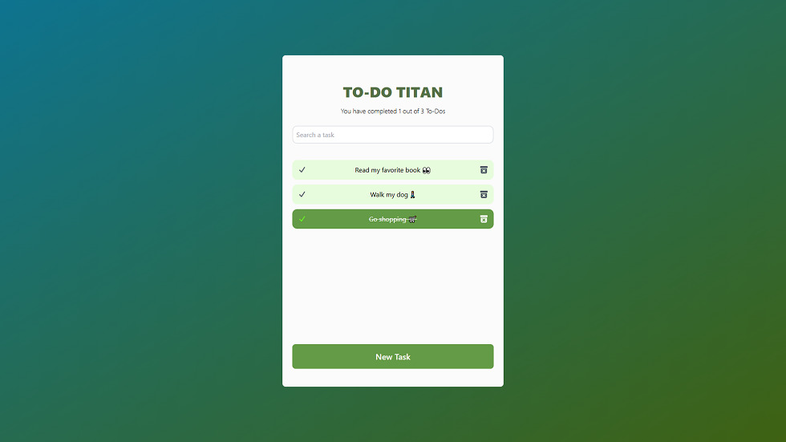
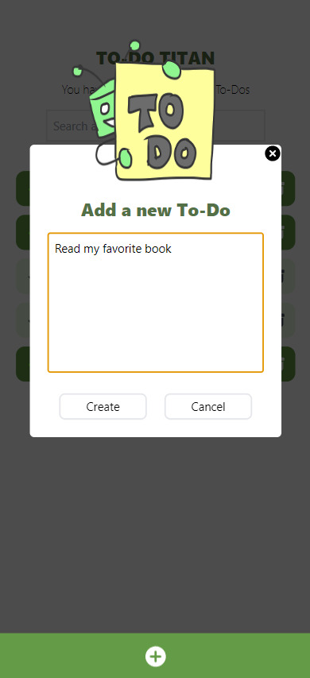

# TO-DO TITAN

To-Do Titan is a powerful and intuitive task management application designed to streamline your daily life. Built with React, Vite.js, and TailwindCSS, To-Do Titan offers a seamless and efficient experience for organizing your tasks. With To-Do Titan, you can easily create, manage, and track your daily to-do lists. Add new tasks with ease, mark them as completed, or delete them as needed. Simply jot down your daily itinerary, and let To-Do Titan ensure you stay on top of everything throughout the day and month. Never miss a task again with To-Do Titan—your ultimate productivity companion.

  

## Demo

Experience all the features of To-Do Titan by visiting the following link:
[To-Do Titan](https://developerleonardo.github.io/todo-titan/)

  

## Available Scripts

In the project directory, you can run:

### `npm run dev`

Runs the app in development mode. Open [http://localhost:5173/](http://localhost:5173/) to view it in your browser.

The page will reload when you make changes. You may also see any lint errors in the console.

### `npm run build`

Builds the app for production to the `dist` folder. It correctly bundles React in production mode and optimizes the build for the best performance.

## Author

Made with 💚 by [Leonardo Salazar](https://www.linkedin.com/in/leonardo-salazar-serna/)
